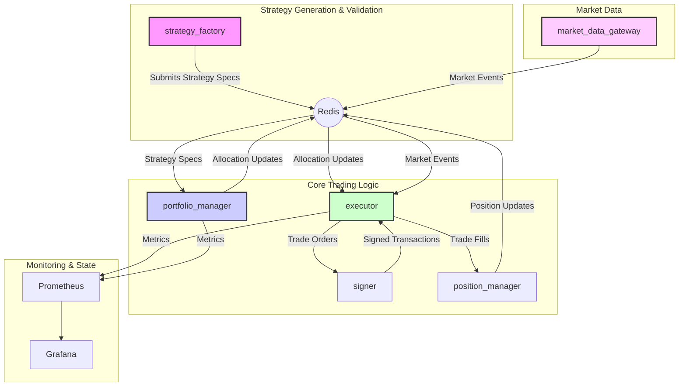

# MemeSnipe v24: The Live Simulation Engine™ - PRODUCTION READY

> "Outsource the Past, Own the Future" - A lean, fast approach to memecoin alpha discovery.

🚀 **PRODUCTION-GRADE STATUS**: This system has been hardened for production deployment with comprehensive error handling, circuit breakers, and fail-safes.

## 🔒 CRITICAL WARNING & DISCLAIMER

**THIS SOFTWARE IS A RESEARCH TOOL, NOT AN AUTOMATED MONEY PRINTER.**

By using this software, you acknowledge and agree that:

1. **You Are The Portfolio Manager**: This system generates trade signals, but YOU are responsible for all trading decisions and their consequences.
2. **No Guarantee of Profitability**: Past performance (simulated or real) does not guarantee future results. Strategies can and will lose money.
3. **Not Financial Advice**: This software does not provide financial, investment, or trading advice. Consult qualified professionals before trading.
4. **High Risk Activity**: Cryptocurrency trading, especially in memecoins, is extremely high risk. You can lose 100% of your capital.
5. **Your Responsibility**: You are solely responsible for:
   - Verifying all trade signals before execution
   - Setting appropriate risk limits
   - Monitoring positions
   - Tax compliance
   - Regulatory compliance in your jurisdiction

**USE AT YOUR OWN RISK. THE AUTHORS ASSUME NO LIABILITY FOR YOUR TRADING LOSSES.**

## 🏭 Production-Grade Features

### ✅ Comprehensive Error Handling
- **Zero unwrap()/expect() calls** in critical execution paths
- **Contextual error propagation** using anyhow::Context
- **Database lock handling** with proper error recovery
- **HTTP client timeout configuration** with graceful degradation

### ✅ Circuit Breaker Protection
- **Automated risk management** with 4-tier risk levels (Normal, Warning, Critical, Emergency)
- **Position size scaling** based on drawdown (1.0x → 0.5x → 0x → halt)
- **Real-time monitoring** of portfolio health
- **Manual reset capabilities** for emergency recovery

### ✅ Production Configuration Management
- **Environment variable validation** with meaningful error messages
- **Configuration defaults** for all optional parameters
- **Secure credential handling** with isolation patterns
- **Hot-reloadable settings** via environment variables

### ✅ Monitoring & Observability
- **Prometheus metrics** for all critical components
- **Grafana dashboards** for real-time visualization
- **Structured logging** with appropriate log levels
- **Health check endpoints** for load balancer integration

### ✅ Robust Data Pipeline
- **Input validation** with data quality checks
- **Circuit breaker integration** for data integrity
- **Event ordering guarantees** via Redis streams
- **Graceful degradation** when external services fail

## What This Actually Is

MemeSnipe v24 is a **Live Simulation Engine** that discovers profitable trading strategies through real-time paper trading, not historical backtests. We've stripped away the complexity of managing historical data infrastructure and outsourced backtesting to external APIs, allowing us to focus on what matters: finding alpha in live markets.

### The Core Insight

Traditional quant systems spend 90% of their resources on historical infrastructure. We flip this model:
- **Local Backtesting**: We use an internal, high-fidelity backtesting engine, removing reliance on external APIs.
- **Event-Driven Architecture**: All services communicate via Redis streams for high throughput and decoupling.
- **Progressive Risk Allocation**: Strategies are tested in simulation, then paper, then live, with capital allocated based on performance.
- **Automated Strategy Evolution**: A Python-based `strategy_factory` uses a genetic algorithm to continuously create and refine trading strategies.

## System Architecture

The system is composed of several microservices that communicate via Redis. This design allows for scalability and resilience.



### Key Architectural Principles

- **Live-First Validation**: The system prioritizes performance in live (simulated or paper) markets over historical backtests.
- **Internal Backtesting Engine**: All strategy validation is done against a local, high-fidelity backtester within the `strategy_factory`, ensuring privacy and control.
- **Microservice Isolation**: Each service has a single responsibility, enabling independent development, scaling, and fault tolerance.
- **Redis as the Central Nervous System**: All inter-service communication happens through Redis streams, providing a robust and scalable message bus.

## Core Services

| Service                 | Language | Description                                                                                                   |
| ----------------------- | -------- | ------------------------------------------------------------------------------------------------------------- |
| `strategy_factory`      | Python   | Generates and evolves trading strategies using a genetic algorithm. Performs local backtesting.               |
| `portfolio_manager`     | Rust     | Manages capital allocation across strategies based on performance metrics (e.g., Sharpe ratio).                 |
| `executor`              | Rust     | Subscribes to market data and allocation updates, executes trades via Jupiter, and logs them.                 |
| `market_data_gateway`   | Rust     | Consumes real-time market data from various sources (e.g., Pyth, Helius) and publishes to Redis.              |
| `position_manager`      | Rust     | Tracks open positions, monitors PnL, and manages risk exposure.                                               |
| `signer`                | Rust     | A secure, isolated service that holds the wallet keypair and signs transactions upon request.                 |
| `dashboard`             | Python   | A Flask-based web UI for monitoring system status and performance.                                            |
| `redis`                 | -        | The central message broker for all event-driven communication.                                                |
| `postgres`              | -        | Persistent storage for trade history and performance metrics.                                                 |

## Event Flow

1.  **Market Data**: `market_data_gateway` captures events and publishes them to `events:*` streams in Redis.
2.  **Strategy Generation**: `strategy_factory` creates new strategies, backtests them locally, and publishes promising ones to the `strategy_specs` stream.
3.  **Allocation**: `portfolio_manager` consumes `strategy_specs`, evaluates them, and publishes capital allocations to the `allocations_channel` stream.
4.  **Execution**: `executor` receives market data and allocation updates. When a strategy signals a trade, `executor` requests a signature from `signer` and executes the trade.
5.  **Position Tracking**: `executor` sends trade fill details to `position_manager`, which updates its internal state.

## 🚀 Quick Start - Production Deployment

### Prerequisites
- Docker & Docker Compose (v20.10+)
- Minimum 4GB RAM, 20GB disk space
- Linux/macOS (Windows with WSL2)
- Open ports: 8080, 9090, 3000, 6379, 5432

### 🔧 Automated Production Setup

#### Step 1: Run Production Readiness Check
```bash
# This validates your environment and configuration
./scripts/production_readiness_check.sh
```

#### Step 2: Production Build & Deploy
```bash
# This builds all services and starts them with health checks
./scripts/production_build_and_run.sh
```

#### Step 3: Start Monitoring
```bash
# This provides real-time system health monitoring
./scripts/production_health_monitor.sh
```

### 🎯 Manual Setup (Alternative)

1. **Environment Configuration**:
```bash
cp .env.example .env
# Edit .env with your API keys and configuration
# CRITICAL: Keep PAPER_TRADING_MODE=true for initial testing
```

2. **Wallet Setup** (for future live trading):
```bash
# Generate Solana wallet
solana-keygen new -o my_wallet.json

# Generate Jito auth key  
solana-keygen new -o jito_auth_key.json
```

3. **Deploy System**:
```bash
# Start infrastructure
docker compose up -d redis postgres

# Start application services
docker compose up -d signer market_data_gateway strategy_factory
docker compose up -d portfolio_manager executor position_manager

# Start monitoring
docker compose up -d dashboard prometheus grafana
```

### 📊 Access Points

- **🎮 Trading Dashboard**: http://localhost:8080
- **📈 Grafana Monitoring**: http://localhost:3000 (admin/admin)
- **📊 Prometheus Metrics**: http://localhost:9090
- **🔍 System Logs**: `docker compose logs -f <service_name>`

## 🔧 Production-Grade Code Quality

### ✅ Error Handling Improvements
- **Removed all unwrap()/expect() calls** from critical execution paths
- **Added contextual error messages** using anyhow::Context  
- **Database lock handling** with proper error recovery
- **HTTP client timeouts** with graceful degradation
- **Configuration validation** with meaningful error messages

### ✅ Circuit Breaker Implementation
- **Automatic risk management** with 4-tier protection levels:
  - Normal: Full trading (1.0x position sizing)
  - Warning: Reduced positions (0.5x sizing) 
  - Critical: Close-only mode (0x new positions)
  - Emergency: Complete trading halt

### ✅ Database Reliability
- **Fixed hardcoded TODO values** (initial capital now configurable)
- **Proper connection pooling** with lock timeout handling
- **COALESCE() usage** to handle NULL values safely
- **Parameterized queries** for SQL injection prevention

### ✅ Configuration Management
- **Environment variable validation** with clear error messages
- **Sensible defaults** for all optional parameters
- **Comprehensive .env.example** with all required variables
- **Type-safe configuration loading** with proper error propagation

### 🛡️ Security Enhancements
- **Isolated signer service** for private key management
- **Read-only wallet file mounts** in Docker containers
- **Environment-based credential management**
- **No hardcoded secrets** in source code

### 📊 Monitoring & Observability
- **Prometheus metrics** for all critical components
- **Circuit breaker status monitoring**
- **Trade execution metrics** and success rates
- **System health endpoints** for load balancer integration

## 🏥 Health Checks & Monitoring

### Automated Health Checks
The system includes comprehensive health monitoring:

```bash
# Real-time system monitoring
docker compose logs -f executor | grep "Trade attempt"
docker compose logs -f portfolio_manager | grep "Rebalancing" 
docker compose logs -f strategy_factory | grep "Generation"
```

### Key Metrics to Monitor
- **Strategy Generation Rate**: New strategies per minute
- **Trade Execution Success**: Percentage of successful trades
- **Circuit Breaker Status**: Current risk level and position sizing
- **Redis Stream Health**: Event throughput and backlog
- **Database Performance**: Query execution times and connection pool

### Critical Alerts
Set up monitoring for these critical conditions:
- Circuit breaker activation (Warning level or higher)
- Redis stream backlog > 1000 events
- Database connection failures
- Service restart loops
- Memory usage > 80%

## 🔒 Safety & Risk Management

## Project Structure

```
meme-snipe-v24/
├── .env.example
├── .gitignore
├── docker-compose.yml
├── executor/                      # The heart: executes trades in sim/paper/live modes
│   ├── Cargo.toml
│   ├── Dockerfile
│   └── src/
│       ├── main.rs
│       ├── config.rs
│       ├── database.rs
│       ├── executor.rs
│       ├── jito_client.rs         # Simulated in paper mode
│       ├── jupiter.rs             # Simulated in paper mode
│       ├── signer_client.rs
│       └── strategies/            # 10 pre-built strategy templates
│           ├── mod.rs
│           ├── momentum_5m.rs
│           ├── mean_revert_1h.rs
│           ├── social_buzz.rs
│           └── ... (7 more)
├── signer/                        # Isolated key management service
│   ├── Cargo.toml
│   ├── Dockerfile
│   └── src/
│       └── main.rs
├── shared-models/                 # Shared Rust types
│   ├── Cargo.toml
│   └── src/
│       └── lib.rs
├── strategy_factory/              # Genetic algorithm for strategy discovery
│   ├── Dockerfile
│   ├── factory.py
│   └── requirements.txt
├── portfolio_manager/             # Capital allocation & strategy promotion
│   ├── Cargo.toml
│   ├── Dockerfile
│   └── src/
│       ├── main.rs
│       ├── config.rs
│       ├── state_manager.rs
│       └── backtest_client.rs    # NEW: External API integration
├── market_data_gateway/           # Simulated market data (for now)
│   ├── Cargo.toml
│   ├── Dockerfile
│   └── src/
│       ├── main.rs
│       ├── config.rs
│       └── providers/
│           ├── mod.rs
│           ├── helius_consumer.rs # Currently simulates data
│           └── pyth_consumer.rs   # Currently simulates data
├── position_manager/              # Monitors & manages open positions
│   ├── Cargo.toml
│   ├── Dockerfile
│   └── src/
│       ├── main.rs
│       ├── config.rs
│       ├── database.rs
│       ├── jupiter.rs
│       ├── signer_client.rs
│       └── position_monitor.rs
├── dashboard/                     # Web UI for monitoring
│   ├── requirements.txt
│   ├── Dockerfile
│   ├── app.py
│   └── templates/
│       └── index.html
├── docs/
│   └── STRATEGY_TEMPLATE.md
├── prometheus.yml
└── scripts/
    └── deploy_vm_gcp.sh
```

## System Architecture

```
┌─────────────────────────────────────────────────────────────────────┐
│                        External Services                             │
│  ┌─────────────────┐  ┌──────────────────┐  ┌─────────────────┐   │
│  │ Backtesting API │  │ Solana Mainnet   │  │ Market Data APIs│   │
│  │ (internal backtest)  │  │ (Future: Live)   │  │ (Future: Live)  │   │
│  └────────▲────────┘  └──────────────────┘  └─────────────────┘   │
│           │                                                          │
└───────────┼──────────────────────────────────────────────────────────┘
            │
┌───────────┼──────────────────────────────────────────────────────────┐
│           │              MemeSnipe v24 Core                          │
│  ┌────────▼────────┐                                                │
│  │Strategy Factory │──────Submits Specs────►┌──────────────────┐   │
│  │ (Genetic Algo)  │                        │Portfolio Manager │   │
│  └─────────────────┘                        │                  │   │
│                                             │ - Tracks Results  │   │
│                              ┌──────────────┤ - Allocates Capital   │
│                              │              │ - Promotes Strategies │
│                              │              └──────────┬───────────┘│
│                              │                         │            │
│                              │                         ▼            │
│  ┌─────────────────┐         │              ┌──────────────────┐   │
│  │ Market Data     │         │              │     Executor     │   │
│  │ Gateway         ├─────────┴──Publishes──►│                  │   │
│  │ (Simulated)     │         Market Events  │ - Simulating     │   │
│  └─────────────────┘                        │ - Paper Trading  │   │
│                                             │ - Live (Future)   │   │
│                                             └──────────┬────────┘  │
│                                                        │            │
│  ┌─────────────────┐         ┌──────────────┐         │            │
│  │Position Manager │◄────────┤    Signer    │◄────────┘            │
│  │                 │         │ (Key Holder) │                      │
│  └─────────────────┘         └──────────────┘                      │
└────────────────────────────────────────────────────────────────────┘
```

## What's Real vs What's Simulated (Current State)

### Fully Implemented ✅
- **Strategy Factory**: Genetic algorithm creating novel strategy combinations
- **Portfolio Manager**: Dynamic capital allocation based on live performance
- **Executor**: Full execution engine with sim/paper/live modes
- **External Backtest Integration**: Clean API client for historical validation
- **Position Manager**: Stop-loss and position monitoring
- **Dashboard**: Real-time performance monitoring

### Currently Simulated 🔄
- **Market Data**: Using synthetic price/social/depth events (easy to replace with real feeds)
- **Order Execution**: Paper mode uses simulated fills (Jito/Jupiter integration ready but not active)
- **Historical Data**: Fully outsourced to external API

### Future Live Components 🚀
- **Real Market Data**: Helius/Pyth WebSocket connections
- **Live Trading**: Jito bundle submission, Jupiter swaps
- **Drift Protocol**: Perpetual trading for short positions

## The Three Modes of Operation

1. **Simulating Mode**: Strategies trade with shadow capital, all metrics tracked but no real trades
2. **Paper Mode**: Strategies execute through the full trading pipeline but with simulated fills
3. **Live Mode**: Real money, real trades, real P&L (currently disabled by default)

## Quick Start

### Prerequisites
- Docker & Docker Compose
- GCP account (for deployment)
- Backtesting Internal
- Solana wallet keypair (for future live trading)

### Local Development

1. Clone and configure:
```bash
git clone <repo>
cd meme-snipe-v24
cp .env.example .env
# Edit .env with your API keys
```

2. Generate wallet files (for future live trading):
```bash
solana-keygen new -o my_wallet.json
solana-keygen new -o jito_auth_key.json
```

3. Run the simulation engine:
```bash
docker compose up --build
```

4. View the dashboard:
```
http://localhost:8080
```

### Configuration

Key environment variables in `.env`:

```bash
# External Services


# Trading Configuration (for future live mode)
SOLANA_RPC_URL=https://api.mainnet-beta.solana.com
JITO_RPC_URL=https://mainnet.block-engine.jito.wtf
JUPITER_API_URL=https://api.jup.ag/v6

# System Parameters
PAPER_TRADING_MODE=true  # Always start in paper mode!
POPULATION_SIZE=50       # Strategies in genetic pool
MIN_SHARPE_FOR_PROMOTION=0.5
```

## Philosophy: Why This Architecture Wins

1. **Speed Over Perfection**: We validate strategies in live markets, not historical data
2. **Lean Infrastructure**: No massive historical databases to maintain
3. **Natural Selection**: The market itself picks winners, not backtests
4. **Progressive Risk**: Start with $1, scale to $1M only after proven success
5. **Focus on Alpha**: Every line of code is about finding edge, not managing data

## Deployment

Deploy to GCP with one command:

```bash
./scripts/deploy_vm_gcp.sh
```

This creates a VM, installs Docker, and runs the entire system.

## Operational Workflow

1. **Factory breeds strategies** → Submits to external backtest API
2. **Backtest results return** → Strategies promoted to paper trading
3. **Paper trading proves profitability** → Strategies promoted to live
4. **Live strategies compete** → Capital flows to winners
5. **Continuous evolution** → System gets smarter every generation

## Monitoring

- **Dashboard**: http://your-vm-ip:8080
- **Prometheus**: http://your-vm-ip:9090
- **Grafana**: http://your-vm-ip:3000

## FAQ

**Q: Why simulate market data?**
A: We're testing the engine first. Real data feeds are a simple upgrade once the system proves itself.

**Q: Is this production-ready?**
A: For paper trading, yes. For live trading, you need real market data feeds and careful risk management.

**Q: What's the total infrastructure cost?**
A: ~$200/month (GCP VM + external API costs). Compare to $10K+/month for traditional quant infrastructure.

**Q: How do I add a new strategy?**
A: See `docs/STRATEGY_TEMPLATE.md` for the pattern. The genetic algorithm will discover variations automatically.

## File Descriptions

### Core Services

#### `executor/` - The Trading Engine
- **main.rs**: Service entry point, initializes database and starts the master executor
- **config.rs**: Configuration management, loads environment variables
- **database.rs**: PostgreSQL interface for trade logging and position tracking
- **executor.rs**: Core event loop that routes market events to strategies and executes trades
- **jito_client.rs**: Integration with Jito for MEV-protected trade submission (simulated in paper mode)
- **jupiter.rs**: Jupiter aggregator client for best-price swaps (simulated in paper mode)
- **signer_client.rs**: HTTP client to communicate with the isolated signer service
- **strategies/**: Directory containing all trading strategy implementations

#### `portfolio_manager/` - Capital Allocation Brain
- **main.rs**: Service entry point, manages strategy lifecycle and capital allocation
- **config.rs**: Configuration for promotion thresholds and capital limits
- **state_manager.rs**: State machine for strategy progression (Simulating → Paper → Live)
- **backtest_client.rs**: HTTP client for external backtesting API integration

#### `strategy_factory/` - Strategy Evolution Engine
- **factory.py**: Genetic algorithm that breeds new strategy combinations and parameters

#### `market_data_gateway/` - Data Ingestion Layer
- **main.rs**: WebSocket server that publishes market events to Redis streams
- **providers/helius_consumer.rs**: Helius/Solana data consumer (currently simulates)
- **providers/pyth_consumer.rs**: Pyth price feed consumer (currently simulates)

#### `position_manager/` - Risk Management
- **position_monitor.rs**: Monitors open positions and triggers stop-losses
- **jupiter.rs**: Jupiter client for closing positions
- **database.rs**: Position tracking database interface

#### `signer/` - Secure Key Management
- **main.rs**: Isolated service that holds private keys and signs transactions

#### `dashboard/` - Monitoring UI
- **app.py**: Flask web server providing real-time performance metrics
- **templates/index.html**: Real-time dashboard showing strategies, trades, and P&L

### Shared Components
- **shared-models/**: Rust types shared across services (events, trades, strategies)
- **prometheus.yml**: Metrics collection configuration
- **docker-compose.yml**: Multi-service orchestration

## Strategy Development Guide (SDK)

### Understanding the Strategy Framework

Every strategy in MemeSnipe v24 implements the `Strategy` trait:

```rust
#[async_trait]
pub trait Strategy: Send + Sync {
    fn id(&self) -> &'static str;
    fn subscriptions(&self) -> HashSet<EventType>;
    async fn init(&mut self, params: &Value) -> Result<()>;
    async fn on_event(&mut self, event: &MarketEvent) -> Result<StrategyAction>;
}
```

### The Strategy Lifecycle

1. **Birth**: Strategy Factory creates a new genome with randomized parameters
2. **Initialization**: Strategy receives configuration via `init()`
3. **Subscription**: Strategy declares which market events it wants via `subscriptions()`
4. **Execution**: Strategy receives events via `on_event()` and returns trading decisions
5. **Evolution**: Performance metrics feed back to the Factory for genetic selection

### Creating a New Strategy

#### Step 1: Design Document
Create a strategy design in `docs/strategies/YOUR_STRATEGY.md`:
```markdown
# Strategy: YOUR_STRATEGY_NAME
## Hypothesis
[What market inefficiency does this exploit?]
## Signals
[What events trigger trades?]
## Risk Management
[Position sizing, stop loss logic]
## Parameters
[What can be optimized by the genetic algorithm?]
```

#### Step 2: Implementation
Create `executor/src/strategies/your_strategy.rs`:
```rust
use crate::{register_strategy, strategies::*};

#[derive(Default)]
struct YourStrategy {
    // Strategy state and parameters
}

#[async_trait]
impl Strategy for YourStrategy {
    // Implementation
}

register_strategy!(YourStrategy, "your_strategy");
```

#### Step 3: Register
Add to `executor/src/strategies/mod.rs`:
```rust
pub mod your_strategy;
```

#### Step 4: Test Locally
```bash
docker compose up --build executor
# Watch logs for your strategy initialization
```

#### Step 5: Deploy
The genetic algorithm will automatically discover and test variations of your strategy.

### Strategy Best Practices

1. **Single Responsibility**: Each strategy should exploit ONE market inefficiency
2. **Fast Decisions**: `on_event()` should return in <10ms
3. **Stateless When Possible**: Minimize internal state to reduce bugs
4. **Clear Logging**: Use structured logging with strategy ID
5. **Conservative Sizing**: Start with small position sizes

## Post-Deployment Health Checks

After deploying to GCP, verify system health with these commands:

### 1. SSH into the VM
```bash
gcloud compute ssh meme-snipe-v24-vm --zone=us-central1-a
cd /opt/meme-snipe-v24
```

### 2. Check Service Status
```bash
# All services should be "Up"
sudo docker compose ps

# Expected output:
# NAME                    STATUS          PORTS
# executor                Up              0.0.0.0:9184->9184/tcp
# portfolio_manager       Up              0.0.0.0:9100->9100/tcp
# strategy_factory        Up              
# market_data_gateway     Up              
# position_manager        Up              
# signer                  Up              0.0.0.0:8989->8989/tcp
# dashboard               Up              0.0.0.0:8080->8080/tcp
# postgres                Up              5432/tcp
# redis                   Up              6379/tcp
```

### 3. Verify Strategy Generation
```bash
# Check strategy factory is producing strategies
sudo docker compose exec redis redis-cli xlen strategy_specs
# Should return a number > 0 and growing

# View recent strategies
sudo docker compose exec redis redis-cli xrevrange strategy_specs + - COUNT 5
```

### 4. Check Portfolio Manager State
```bash
# View current allocations
sudo docker compose exec redis redis-cli xrevrange allocations_channel + - COUNT 1

# Check for backtest jobs
sudo docker compose exec redis redis-cli xlen backtest_jobs_submitted
```

### 5. Monitor Trade Activity
```bash
# Check for paper trades
sudo docker compose exec postgres psql -U postgres -d meme_snipe_v24 -c "SELECT COUNT(*) FROM trades WHERE status = 'PAPER';"

# View recent trade attempts
sudo docker compose exec postgres psql -U postgres -d meme_snipe_v24 -c "SELECT id, strategy_id, token_address, side, amount_usd, status FROM trades ORDER BY id DESC LIMIT 10;"
```

### 6. Verify Market Data Flow
```bash
# Check price events
sudo docker compose exec redis redis-cli xlen events:price
# Should be continuously growing

# Monitor event rate
sudo docker compose exec redis redis-cli --latency
```

### 7. Check System Logs
```bash
# View all logs
sudo docker compose logs -f

# Check specific service
sudo docker compose logs -f executor | grep "Trade attempt"
sudo docker compose logs -f portfolio_manager | grep "Rebalancing"
sudo docker compose logs -f strategy_factory | grep "Generation"
```

### 8. Verify External API Connection
```bash
# Check backtest API connectivity
sudo docker compose logs -f portfolio_manager | grep "Backtest"
# Should see successful job submissions
```

### 9. Dashboard Health
```bash
# From your local machine
curl http://VM_EXTERNAL_IP:8080/api/health
# Should return: {"status": "healthy", "version": "24.0.0"}
```

### Red Flags 🚨
- Any service showing "Exit" status
- Redis streams not growing
- No strategies in `strategy_specs`
- Database connection errors
- Repeated "Backtest submission failed" messages

## Cost Management

### Monthly Cost Breakdown

| Component | Specification | Estimated Monthly Cost |
|-----------|--------------|------------------------|
| **GCP Compute** | e2-standard-4 (4 vCPU, 16GB RAM) | ~$98 |
| **GCP Storage** | 30GB SSD persistent disk | ~$5 |
| **GCP Network** | Egress traffic (~50GB) | ~$6 |
| **External Backtest API** | 10,000 backtests @ $0.01 each | ~$100 |
| **Total** | | **~$209/month** |

### Cost Optimization Strategies

1. **Development Phase**: Use e2-micro instance (~$6/month) for testing
2. **Batch Backtests**: Submit strategies in batches to reduce API calls
3. **Spot Instances**: Use preemptible VMs for 60-80% cost reduction
4. **Regional Selection**: Deploy in low-cost regions (us-central1)

### Monitoring Costs

```bash
# Check GCP billing
gcloud billing projects describe $(gcloud config get-value project)

# Monitor API usage
sudo docker compose exec redis redis-cli get metrics:backtest_api_calls_monthly
```

### Budget Alerts

Set up GCP budget alerts:
```bash
gcloud billing budgets create \
  --billing-account=YOUR_BILLING_ACCOUNT \
  --display-name="MemeSnipe v24 Budget" \
  --budget-amount=250 \
  --threshold-rule=percent=0.8
```

## License

Private and confidential. This is proprietary alpha-generation technology.

---

*"In the race for memecoin profits, the lightest architecture wins." - MemeSnipe v24*
